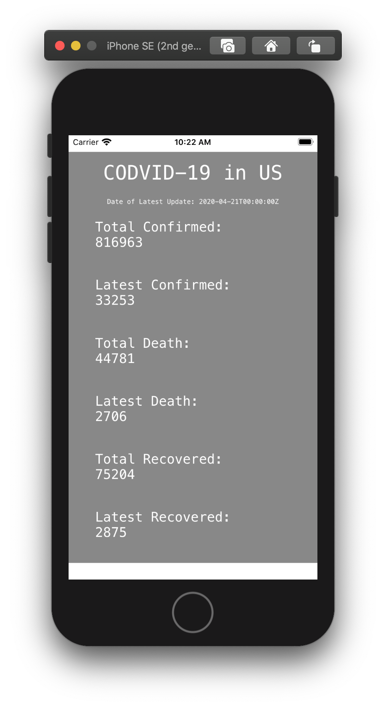

<!--

Slide:
https://docs.google.com/presentation/d/1R1i_fc9uAcSylbZ0uu6gma8cF5VG0DXqznYduvO1VCQ/edit#slide=id.g729a8d16a3_0_37

    Step 1: Setup your REACT Native Environment
    https://reactnative.dev/docs/environment-setup
    
    Step 2: Go through REACT native Tutorial
    https://reactnative.dev/docs/tutorial
    
    Step 3: Develop use case to display a map.
    https://github.com/react-native-community/react-native-maps
    
    Step 4: On separate branch, exercise the CODVID-19 API (Documentation using postman)
        and display the data in your application as text.  Be fancy!  Style your results.
    https://covid19api.com/
    https://documenter.getpostman.com/view/10808728/SzS8rjbc?version=latest
    
    Step 5: Overlay the data on the maps.

-->

# CODVID-19 App

## Hello Project
Just a hello world project for homework grading.

[Project root is here.](HelloProject)

[Project readme file is here.](HelloProject/Readme.md)

## Map Display
Step 3

Display the map on my device. The [source code](steps/App_Step3.js) is here.

## CODVID-19 API Usage
Step 4

Please checkout branch [step4](https://github.com/BUEC500C1/codvid-app-JWangNov/tree/step4) to see implementation.

## My CODVID-19 Data-mapping App
[Step 5](steps/RPReplay_Final1587828013.MOV)

